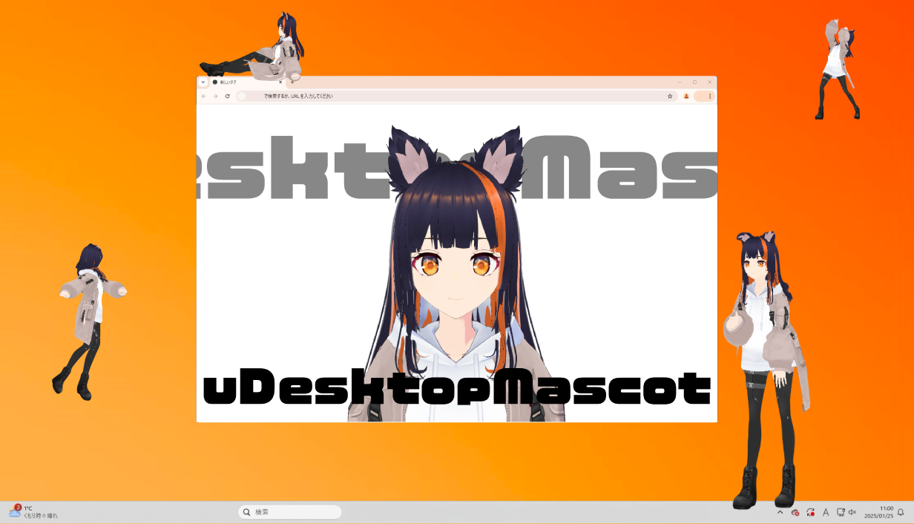

# uDesktopMascot

[](https://unity.com/releases/editor/archive)
[](https://github.com/MidraLab/uDesktopMascot/releases)
[](https://github.com/MidraLab/uDesktopMascot/actions/workflows/edit-test.yml)

日本語 | [English](README_EN.md) | [中文](README_CN.md) | [Español](README_ES.md) | [Français](README_FR.md)

**注意**: 上述语言（English、中文、Español、Français）由 GPT-4o-mini 自动翻译生成。翻译的准确性和细节方面，请参考原文（日本語）。

<!-- TOC -->
* [uDesktopMascot](#udesktopmascot)
  * [概述](#概述)
  * [功能列表](#功能列表)
  * [在 macOS 上运行](#在-macos-上运行)
  * [要求](#要求)
  * [许可证](#许可证)
  * [素材说明](#素材说明)
  * [制作人员致谢](#制作人员致谢)
  * [第三方声明](#第三方声明)
  * [赞助商](#赞助商)
<!-- TOC -->

## 概述

「uDesktopMascot」是一个以 `创作的自由化` 为主题的桌面吉祥物应用程序的开源项目。作为功能之一，支持读取 VRM 和 GLB/FBX 格式的模型，并在桌面上显示。此外，还可以自由设置菜单界面和应用程序窗口等 GUI 的颜色和背景图片。详细的功能列表请参阅 [功能列表](#功能列表)。



**支持平台**
* Windows 10/11
* macOS

## 功能列表

应用程序实现了以下功能。详细信息请参见以下列表。

通过将外部资产放入 StreamingAssets 文件夹来实现。

<details>

<summary>模型与动画</summary>

* 读取并显示放置在 StreamingAssets 中的任意模型文件。
  * 支持 VRM（1.x, 0.x）格式的模型。
  * 支持 GLB/GLTF 格式的模型。（不支持动画）
  * 支持 FBX 格式的模型。（但某些模型的纹理可能无法加载，且不支持动画）
    * 纹理可以通过放置于 StreamingAssets/textures/ 中进行加载。

</details>

<details>

<summary>音效与背景音乐</summary>

* 从 StreamingAssets/Voice/ 中读取并播放音频文件。如果有多个，则随机播放。
  * 点击时播放的音频从 StreamingAssets/Voice/Click/ 中读取并播放音频文件。
* 从 StreamingAssets/BGM/ 中读取并播放音乐文件。如果有多个，则随机播放。
* 默认角色的配音
  * 默认配音使用 [COEIROINK:つくよみちゃん](https://coeiroink.com/character/audio-character/tsukuyomi-chan) 的语音。
  * 应用启动时、应用结束时、点击时会播放这些语音。

</details>

<details>

<summary>通过文本文件进行应用程序设置</summary>
可以通过 application_settings.txt 文件更改应用程序的设置。

设置文件的结构如下所示：

```txt
[Character]
ModelPath=default.vrm
TexturePaths=test.png
Scale=3
PositionX=0
PositionY=0
PositionZ=0
RotationX=0
RotationY=0
RotationZ=0

[Sound]
VoiceVolume=1
BGMVolume=0.5
SEVolume=1

[Display]
Opacity=1
AlwaysOnTop=True

[Performance]
TargetFrameRate=60
QualityLevel=2
```

</details>

<details>

<summary>菜单界面</summary>

* 可以设置菜单界面的背景图片和背景颜色。
  * 背景图片可以从 StreamingAssets/Menu/ 中读取相应的图片文件。支持的图片格式如下：
    * PNG
    * JPG（JPEG）
    * BMP
    * GIF（静态图像）
    * TGA
    * TIFF
  * 背景颜色可以通过指定颜色代码来设置。

</details>

## 在 macOS 上运行

在 macOS 上运行应用程序时，可能会被 GateKeeper 阻止。在这种情况下，请从终端执行以下命令：

```sh
xattr -r -c uDesktopMascot.app
```

## 要求
* Unity 6000.0.31f1（IL2CPP）

## 许可证
* 代码根据 [Apache License 2.0](LICENSE) 进行许可。
* 以下资产根据 [CC BY-NC 4.0](https://creativecommons.org/licenses/by-nc/4.0/) 进行许可。
  * BGM
  * 模型

## 素材说明
* 默认角色动画使用 [『VRMお人形遊び』用动画数据收集](https://fumi2kick.booth.pm/items/1655686) 制作。已确认可以包含并分发于仓库中。
* 字体使用 [Noto Sans Japanese](https://fonts.google.com/noto/specimen/Noto+Sans+JP?lang=ja_Jpan)。根据 [SIL OPEN FONT LICENSE Version 1.1](https://fonts.google.com/noto/specimen/Noto+Sans+JP/license?lang=ja_Jpan) 重新分发 Noto Sans JP 字体。该字体的著作权归原作者（Google）所有。
* 默认配音使用 [COEIROINK:つくよみちゃん](https://coeiroink.com/character/audio-character/tsukuyomi-chan) 的语音，使用方法已经事先与 COEIROINK 确认。
* 按钮图标使用 [MingCute](https://github.com/MidraLab/MingCute)。

## 制作人员致谢
* 模型: 「アオゾラ」様
* BGM: MidraLab(eisuke)
* 软件图标: やむちゃ様

## 第三方声明

请参见 [NOTICE](./NOTICE.md)。

## 赞助商
- Luna
- uezo