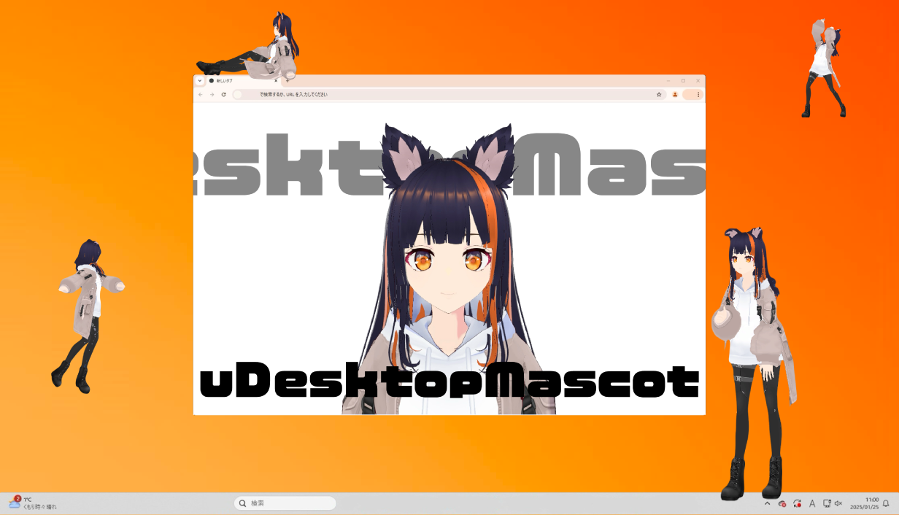

# uDesktopMascot

[](https://unity.com/releases/editor/archive)
[](https://github.com/MidraLab/uDesktopMascot/releases)
[](https://github.com/MidraLab/uDesktopMascot/actions/workflows/edit-test.yml)

日本語 | [English](README_EN.md) | [中文](README_CN.md) | [Español](README_ES.md) | [Français](README_FR.md)

**Note**: The above languages (English, 中文, Español, Français) have been generated by automatic translation using GPT-4o-mini. For accuracy and nuances, please refer to the original text (Japanese).

<!-- TOC -->
* [uDesktopMascot](#udesktopmascot)
  * [Overview](#overview)
  * [Feature List](#feature-list)
  * [Running on macOS](#running-on-macos)
  * [Requirements](#requirements)
  * [License](#license)
  * [Materials](#materials)
  * [Credits](#credits)
  * [3rd Party Notices](#3rd-party-notices)
  * [Sponsor](#sponsor)
<!-- TOC -->

## Overview

"uDesktopMascot" is an open-source project for a desktop mascot application themed around the "liberation of creativity."
As an example of its functionality, it can load VRM and GLB/FBX format models and display them on the desktop. Additionally, the color and background images of GUI elements such as the menu screen and application window can be freely customized.
For a detailed list of features, please refer to the [Feature List](#feature-list).



**Supported Platforms**
* Windows 10/11
* macOS

## Feature List

The application includes the following features. For details, please refer to the list below.

You can add external assets by placing them in the StreamingAssets folder.

<details>

<summary>Models and Animations</summary>

* Displays any model files placed in the StreamingAssets folder.
  * Supports VRM (1.x, 0.x) format models.
  * Supports GLB/GLTF format models (animations are not supported).
  * Supports FBX format models (however, some models may not have textures load properly, and animations are not supported).
    * Textures can be loaded by placing them in StreamingAssets/textures/.

</details>

<details>

<summary>Voice and BGM</summary>

* Loads and plays audio files placed in the StreamingAssets/Voice/ folder. If there are multiple files, they will be played randomly.
  * The audio that plays upon clicking is loaded from the audio files placed in StreamingAssets/Voice/Click/.
* Loads and plays music files placed in the StreamingAssets/BGM/ folder. If there are multiple files, they will be played randomly.
* Adding default character voice
  * The default voice uses audio from [COEIROINK: Tsukuyomi-chan](https://coeiroink.com/character/audio-character/tsukuyomi-chan).
  * It plays when starting the application, closing the application, and clicking.

</details>

<details>

<summary>Application Settings via Text File</summary>
You can change the application settings via the application_settings.txt file.

The structure of the settings file is as follows:

```txt
[Character]
ModelPath=default.vrm
TexturePaths=test.png
Scale=3
PositionX=0
PositionY=0
PositionZ=0
RotationX=0
RotationY=0
RotationZ=0

[Sound]
VoiceVolume=1
BGMVolume=0.5
SEVolume=1

[Display]
Opacity=1
AlwaysOnTop=True

[Performance]
TargetFrameRate=60
QualityLevel=2

```

</details>

<details>

<summary>Menu Screen</summary>

* You can configure the background image and background color of the menu screen.
  * You can load background images from image files placed in StreamingAssets/Menu/. Supported image formats are:
    * PNG
    * JPG (JPEG)
    * BMP
    * GIF (static images)
    * TGA
    * TIFF
  * You can specify background colors using color codes.

</details>

## Running on macOS

When running the application on macOS, the app may be blocked by GateKeeper.
In that case, execute the following command from the terminal:

```sh
xattr -r -c uDesktopMascot.app
```

## Requirements
* Unity 6000.0.31f1 (IL2CPP)

## License
* The code is licensed under the [Apache License 2.0](LICENSE).
* The following assets are licensed under [CC BY-NC 4.0](https://creativecommons.org/licenses/by-nc/4.0/):
  * BGM
  * Models

## Materials
* The default character animations are created using [the "VRM Doll Play" animation data package](https://fumi2kick.booth.pm/items/1655686). It has been confirmed that distribution within the repository is allowed.
* The font used is [Noto Sans Japanese](https://fonts.google.com/noto/specimen/Noto+Sans+JP?lang=ja_Jpan), redistributed under the [SIL OPEN FONT LICENSE Version 1.1](https://fonts.google.com/noto/specimen/Noto+Sans+JP/license?lang=ja_Jpan). The copyright of the font belongs to the original author (Google).
* The default voice uses audio from [COEIROINK: Tsukuyomi-chan](https://coeiroink.com/character/audio-character/tsukuyomi-chan). Usage has been confirmed with COEIROINK beforehand.
* The button icons use [MingCute](https://github.com/MidraLab/MingCute).

## Credits
* Model: "Aozora"
* BGM: MidraLab (eisuke)
* Software Icon: Yamucha

## 3rd Party Notices

See [NOTICE](./NOTICE.md).

## Sponsor
- Luna
- uezo